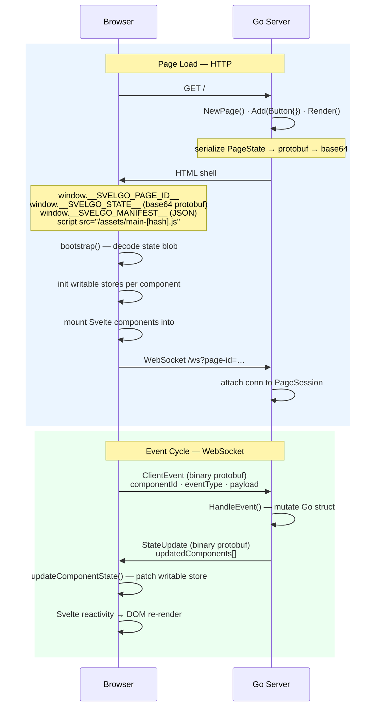

# SvelGo Role
* Help Go developers build rich, interactive web UIs without writing JavaScript or managing a separate frontend codebase.
* Aim for building enterprise web application, not for a web app for end users
* provide a set of UI components that can be used to build internal tools, dashboards, admin panels, etc.

# Architecture

SvelGo is a Go-first UI framework. Developers declare pages and components in Go; the framework renders full HTML pages and keeps the browser in sync over a persistent WebSocket. There is **one server** — no separate Node process in production.

---

## Key Modules

### Framework (Go) — root package `github.com/svelgo/svelgo`

| File | Responsibility |
|---|---|
| `component.go` | `Component` and `EventHandler` interfaces — every UI component must implement these |
| `page.go` | `Page` builder — assembles components, serialises state, writes the HTML response |
| `session.go` | `PageSession` — holds the live component map and WebSocket connection for one page load |
| `ws.go` | `WSHandler` — the WebSocket endpoint; decodes client events, dispatches to components, sends state updates |
| `assets.go` | `Setup()`, `SetStaticFS()` — resolves asset paths (dev: Vite URL, prod: embedded hashed bundle) and registers `/ws` and `/assets/` handlers |
| `template.go` | HTML shell template — the only HTML the server ever writes |
| `proto/ui.proto` | Framework wire types: `PageState`, `ComponentState`, `ClientEvent`, `StateUpdate` |
| `gen/ui/ui.pb.go` | Auto-generated protobuf types (import as `github.com/svelgo/svelgo/gen/ui`) |

### Framework (TypeScript) — npm package `svelgo`

| File | Responsibility |
|---|---|
| `frontend/src/runtime/client.ts` | `bootstrap()` — decodes state blob, mounts Svelte components, opens WebSocket |
| `frontend/src/runtime/proto.ts` | Protobuf encode/decode + `registerComponentDecoder()` |
| `frontend/src/runtime/state.ts` | Per-component Svelte `writable` stores — single source of truth for rendered state |
| `frontend/src/runtime/ws.ts` | WebSocket client — sends `ClientEvent`, receives `StateUpdate`, updates stores |
| `frontend/src/runtime/registry.ts` | `registerComponent()` + `ComponentRegistry` |

### Example App — `example/` (separate `go.mod`)

| File | Responsibility |
|---|---|
| `example/main.go` | HTTP server — Go component structs, route registration |
| `example/embed.go` | `//go:embed all:static` + calls `svelgo.SetStaticFS()` in `init()` |
| `example/proto/app.proto` | App-specific protobuf messages (e.g. `ButtonState`) |
| `example/gen/app/app.pb.go` | Auto-generated app protobuf types |
| `example/frontend/src/main.ts` | App entry point — imports `./proto`, `./registry`, then calls `bootstrap()` |
| `example/frontend/src/proto.ts` | Calls `registerComponentDecoder()` for each app component type |
| `example/frontend/src/registry.ts` | Calls `registerComponent()` for each Svelte component |
| `example/frontend/src/components/` | App Svelte components |

### Shared Contract

`proto/ui.proto` defines the **framework** wire types shared between Go and the browser:

```
PageState        — initial page state, base64-encoded into the HTML shell
ComponentState   — one component's serialised state (id, type, opaque state_bytes)
ClientEvent      — browser → server: (page_id, component_id, event_type, payload)
StateUpdate      — server → browser: updated ComponentState list after an event
```

App-specific state messages (e.g. `ButtonState`) live in `example/proto/app.proto`, not in the framework proto.

---

## Page Rendering Lifecycle

Starting from an HTTP request to `/`:

```
Browser                         Go Server
-------                         ---------

GET /                    -->    1. Route handler runs (example/main.go)

                                2. svelgo.NewPage()
                                   └─ generates a unique pageID (UUID)

                                3. page.Add(&Button{id:"btn-1", label:"Click me (0 clicks)"})
                                   └─ appends component to page's component list

                                4. page.Render(w, r)  [page.go]
                                   │
                                   ├─ a) Build manifest JSON
                                   │     [{id:"btn-1", type:"Button", slot:"root"}]
                                   │
                                   ├─ b) Serialize all component states
                                   │     proto.Marshal(btn.ProtoState())
                                   │       → ButtonState{label, clickCount} bytes
                                   │     Wrap in PageState{pageId, components:[...]}
                                   │     proto.Marshal(pageState) → base64 blob
                                   │
                                   ├─ c) Register session  [session.go]
                                   │     globalSessionStore[pageID] = &PageSession{
                                   │       components: {"btn-1": btn},
                                   │       conn: nil,  // WebSocket not yet connected
                                   │     }
                                   │
                                   └─ d) Execute HTML shell template  [template.go]
                                         Injects:
                                           window.__SVELGO_PAGE_ID__  = "uuid..."
                                           window.__SVELGO_STATE__    = "base64..."
                                           window.__SVELGO_MANIFEST__ = [{...}]
                                         Links /assets/main-[hash].js

HTML response            <--

[Browser parses HTML, executes main.ts]

                                5. bootstrap()  [client.ts]
                                   │
                                   ├─ a) decodePageState(window.__SVELGO_STATE__)
                                   │     base64 → Uint8Array → proto decode → PageState
                                   │
                                   ├─ b) For each ComponentState:
                                   │     decodeComponentState(type, stateBytes)
                                   │       → {label:"Click me (0 clicks)", clickCount:0}
                                   │     initComponentState(id, decoded)
                                   │       → creates writable store for "btn-1"
                                   │
                                   ├─ c) Mount Svelte components
                                   │     For each manifest entry:
                                   │       Ctor = ComponentRegistry["Button"]
                                   │       mount(Ctor, {target: <div>, props: {id}})
                                   │         Button.svelte subscribes to store["btn-1"]
                                   │         Renders: <button>Click me (0 clicks)</button>
                                   │
                                   └─ d) openWebSocket(pageID)  [ws.ts]
                                         ws://localhost:8080/ws?page-id=uuid...
```

After step d, the page is fully interactive. The WebSocket connects to `WSHandler` in Go, which attaches the connection to the existing `PageSession`.

---

## Event Handling

When the user clicks the button:

```
Browser                         Go Server
-------                         ---------

[onclick fires in Button.svelte]

1. sendEvent("btn-1", "click")  [ws.ts]
   encodeClientEvent({
     pageId:      "uuid...",
     componentId: "btn-1",
     eventType:   "click",
     payload:     <empty>,
   })
   socket.send(binaryFrame)  -->

                                2. WSHandler reads frame  [ws.go]
                                   proto.Unmarshal → ClientEvent

                                3. Look up component in session
                                   sess.components["btn-1"] → &Button{...}

                                4. Cast to EventHandler, call HandleEvent
                                   btn.HandleEvent("click", nil)
                                   └─ btn.clickCount++
                                      btn.label = "Click me (1 clicks)"

                                5. Serialize updated state
                                   proto.Marshal(btn.ProtoState())
                                     → ButtonState{label, clickCount:1}
                                   Wrap in StateUpdate{pageId, updatedComponents:[...]}
                                   proto.Marshal(update)

                                6. conn.WriteMessage(binaryFrame) -->

[ws.onmessage fires in ws.ts]

7. decodeStateUpdate(buffer) → StateUpdate
   For each updatedComponent:
     decodeComponentState("Button", stateBytes)
       → {label:"Click me (1 clicks)", clickCount:1}
     updateComponentState("btn-1", decoded)
       → writable store update triggers Svelte re-render

[Button.svelte re-renders with new label — no page reload]
```

---

## How to Add a New Component

### 1. Define state in `example/proto/app.proto`

```protobuf
message CounterState {
  string id    = 1;
  int32  value = 2;
}
```

Run `make -C example proto` to regenerate `example/gen/app/app.pb.go` and `example/frontend/src/app_descriptor.json`.

### 2. Implement the Go component in `example/main.go`

```go
type Counter struct {
    id    string
    value int
}

func (c *Counter) ComponentID()   string { return c.id }
func (c *Counter) ComponentType() string { return "Counter" }
func (c *Counter) Slot()          string { return "root" }

func (c *Counter) ProtoState() proto.Message {
    return &apppb.CounterState{Id: c.id, Value: int32(c.value)}
}

// HandleEvent makes Counter an EventHandler — the framework calls this on user events.
func (c *Counter) HandleEvent(eventType string, _ []byte) error {
    if eventType == "increment" {
        c.value++
    }
    return nil
}
```

### 3. Add it to a page

```go
http.HandleFunc("/counter", func(w http.ResponseWriter, r *http.Request) {
    page := svelgo.NewPage()
    page.Add(&Counter{id: "ctr-1", value: 0})
    page.Render(w, r)
})
```

### 4. Create the Svelte component `example/frontend/src/components/Counter.svelte`

```svelte
<script lang="ts">
  import type { Writable } from 'svelte/store'
  import { getComponentStore } from 'svelgo/runtime/state'
  import { sendEvent } from 'svelgo/runtime/ws'

  let { id }: { id: string } = $props()

  let state: Record<string, unknown> = $state({})
  $effect(() => {
    const store = getComponentStore(id) as Writable<Record<string, unknown>>
    return store.subscribe(s => { state = s })
  })
</script>

<div>
  <p>Count: {state.value ?? 0}</p>
  <button onclick={() => sendEvent(id, 'increment')}>+1</button>
</div>
```

### 5. Register it in `example/frontend/src/registry.ts`

```ts
import { registerComponent } from 'svelgo/runtime/registry'
import Counter from './components/Counter.svelte'

registerComponent('Counter', Counter)
```

### 6. Register the state decoder in `example/frontend/src/proto.ts`

```ts
import { registerComponentDecoder } from 'svelgo/runtime/proto'

registerComponentDecoder('Counter', appRoot.lookupType('app.CounterState'))
```

That's all. The framework automatically handles hydration, WebSocket dispatch, and reactive re-renders.

---

## Data Flow Diagram



---

## Toolchain Explained

### `index.html` vs `template.go`

There are two HTML files in this project and they serve completely different purposes.

**`example/frontend/index.html`** is a stub used only by the Vite dev server when you run `npm run dev` in isolation (i.e., without Go). It contains empty or hardcoded placeholder values for the globals (`__SVELGO_STATE__`, etc.) so the browser doesn't crash during frontend-only development. This file is **never sent to real users**.

**`template.go`** is the real HTML shell. Go executes it on every HTTP request and injects live data:
- `window.__SVELGO_PAGE_ID__` — a fresh UUID for this specific page load
- `window.__SVELGO_STATE__` — the actual base64 protobuf blob encoding all component states
- `window.__SVELGO_MANIFEST__` — the JSON array mapping component IDs to types and slots

When you run `make dev` (which starts both Vite and Go together), every page you visit goes through `template.go`. `example/frontend/index.html` is only relevant if you run `npm run dev` alone.

---

### Proto split: framework vs app

There are **two** protobuf files with different scopes:

```
proto/ui.proto          (framework — never edit for app work)
       │
       ├─ make proto (protoc)
       │
       ├─→ gen/ui/ui.pb.go                       Go structs for framework wire types
       └─→ frontend/src/runtime/ui_descriptor.json    JS decoder table for framework messages

example/proto/app.proto  (app-specific — add your component states here)
       │
       ├─ make -C example proto (protoc)
       │
       ├─→ example/gen/app/app.pb.go             Go structs for app component states
       └─→ example/frontend/src/app_descriptor.json   JS decoder table for app messages
```

**Never edit generated files by hand.** Any change you make will be overwritten the next time `make proto` runs.

---

### Registration pattern

The framework runtime does not know about any specific component types at compile time. Apps register their components at startup:

**Go side** — nothing to register; `HandleEvent` is discovered via interface assertion in `ws.go`.

**TypeScript side** — two registrations per component type:

```ts
// example/frontend/src/registry.ts
import { registerComponent } from 'svelgo/runtime/registry'
registerComponent('Button', Button)   // maps type string → Svelte constructor

// example/frontend/src/proto.ts
import { registerComponentDecoder } from 'svelgo/runtime/proto'
registerComponentDecoder('Button', appRoot.lookupType('app.ButtonState'))  // maps type string → protobuf decoder
```

Both files are imported by `example/frontend/src/main.ts` before calling `bootstrap()`.

---

### Embedding (app requirement)

Apps must embed their compiled frontend and call `SetStaticFS` before `Setup()`:

```go
// example/embed.go
//go:embed all:static
var embeddedStatic embed.FS

func init() {
    sub, _ := fs.Sub(embeddedStatic, "static")
    svelgo.SetStaticFS(sub)
}
```

`SetStaticFS` is not required in dev mode (`SVELGO_DEV=1`).

---

### What Vite does

Vite is the build tool for the TypeScript and Svelte frontend code. It has two modes:

**Dev mode (`npm run dev`)** — starts a hot-reloading server on port `:5173`. When you edit a `.svelte` or `.ts` file, Vite instantly pushes the change to the browser without a full reload. Go (running with `SVELGO_DEV=1`) proxies asset requests to this Vite server instead of serving the embedded bundle.

**Build mode (`npm run build`)** — compiles everything to optimised, content-hashed JavaScript files and writes them to `example/static/`. Content hashing means the filename changes whenever the file contents change (e.g. `main-a3f9c2.js`), which busts browser caches automatically.

Vite also emits **`static/.vite/manifest.json`** — a lookup table that maps source file names to their hashed output names. Go reads this file at startup (in `assets.go`) to know which hashed filename to link in the HTML `<script>` tag. That is why `//go:embed all:static` uses the `all:` prefix: without it, Go silently skips hidden directories like `.vite/` and the manifest is missing.

---

## Commands

```bash
# Development (visit http://localhost:8080)
make dev
# Equivalent to:
cd example/frontend && npm run dev &
cd example && SVELGO_DEV=1 go run .

# Production build
make build
# Equivalent to:
cd example/frontend && npm run build   # outputs to example/static/
cd example && go build -o dist/buttonapp .

# Regenerate FRAMEWORK protobuf artifacts after editing proto/ui.proto
make proto

# Regenerate EXAMPLE app protobuf artifacts after editing example/proto/app.proto
make -C example proto

# Clean build artifacts
make clean
```

---

## Environment Variables

| Variable | Effect |
|---|---|
| `SVELGO_DEV=1` | Serve assets from Vite dev server at `:5173`; skip `SetStaticFS` requirement |
| `SVELGO_DEBUG=1` | Enable debug logging on the Go server and expose `window.__SVELGO_DEBUG__` to the browser runtime |
