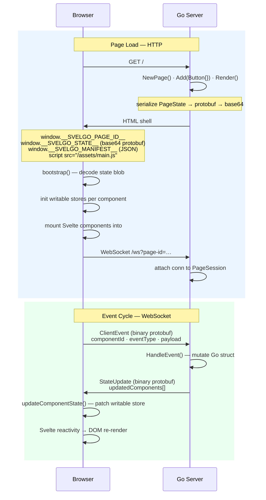

# SvelGo Architecture

SvelGo is a Go-first UI framework. Developers declare pages and components in Go; the framework renders full HTML pages and keeps the browser in sync over a persistent WebSocket. There is **one server** — no separate Node process in production.

---

## Key Modules

### Server (Go)

| File | Package | Responsibility |
|---|---|---|
| `component.go` | `svelgo` | `Component` and `EventHandler` interfaces — every UI component must implement these |
| `page.go` | `svelgo` | `Page` builder — assembles components, serialises state, writes the HTML response |
| `session.go` | `svelgo` | `PageSession` — holds the live component map and WebSocket connection for one page load |
| `ws.go` | `svelgo` | `WSHandler` — the WebSocket endpoint; decodes client events, dispatches to components, sends state updates |
| `assets.go` | `svelgo` | `Setup()` — resolves asset paths (dev: Vite URL, prod: embedded hashed bundle) and registers `/ws` and `/assets/` handlers |
| `template.go` | `svelgo` | HTML shell template — the only HTML the server ever writes |
| `embed.go` | `svelgo` | `//go:embed all:static` — bundles the compiled Svelte assets into the Go binary |
| `gen/ui/ui.pb.go` | `svelgo/gen/ui` | Auto-generated protobuf types from `proto/ui.proto` |
| `cmd/app/main.go` | `main` | Example application — registers HTTP routes using the framework |

### Client (TypeScript / Svelte)

| File | Responsibility |
|---|---|
| `src/main.ts` | Entry point — calls `bootstrap()` |
| `src/runtime/client.ts` | `bootstrap()` — decodes state blob, mounts Svelte components, opens WebSocket |
| `src/runtime/proto.ts` | All protobuf encode/decode logic — only file that knows about binary wire format |
| `src/runtime/state.ts` | Per-component Svelte `writable` stores — single source of truth for rendered state |
| `src/runtime/ws.ts` | WebSocket client — sends `ClientEvent`, receives `StateUpdate`, updates stores |
| `src/runtime/registry.ts` | Maps component type strings (e.g. `"Button"`) to Svelte component constructors |
| `src/components/Button.svelte` | Presentational component — reads state store, fires events; no business logic |

### Shared Contract

`proto/ui.proto` defines all wire types shared between Go and the browser:

```
PageState        — initial page state, base64-encoded into the HTML shell
ComponentState   — one component's serialised state (id, type, opaque state_bytes)
ClientEvent      — browser → server: (page_id, component_id, event_type, payload)
StateUpdate      — server → browser: updated ComponentState list after an event
ButtonState      — component-specific state message (label, click_count)
```

---

## Page Rendering Lifecycle

Starting from an HTTP request to `/`:

```
Browser                         Go Server
-------                         ---------

GET /                    -->    1. Route handler runs (cmd/app/main.go)

                                2. svelgo.NewPage()
                                   └─ generates a unique pageID (UUID)

                                3. page.Add(&Button{id:"btn-1", label:"Click me"})
                                   └─ appends component to page's component list

                                4. page.Render(w, r)  [page.go]
                                   │
                                   ├─ a) Build manifest JSON
                                   │     [{id:"btn-1", type:"Button", slot:"root"}]
                                   │
                                   ├─ b) Serialize all component states
                                   │     proto.Marshal(btn.ProtoState())
                                   │       → ButtonState{label, clickCount} bytes
                                   │     Wrap in PageState{pageId, components:[...]}
                                   │     proto.Marshal(pageState) → base64 blob
                                   │
                                   ├─ c) Register session  [session.go]
                                   │     globalSessionStore[pageID] = &PageSession{
                                   │       components: {"btn-1": btn},
                                   │       conn: nil,  // WebSocket not yet connected
                                   │     }
                                   │
                                   └─ d) Execute HTML shell template  [template.go]
                                         Injects:
                                           window.__SVELGO_PAGE_ID__  = "uuid..."
                                           window.__SVELGO_STATE__    = "base64..."
                                           window.__SVELGO_MANIFEST__ = [{...}]
                                         Links /assets/main-[hash].js

HTML response            <--

[Browser parses HTML, executes main.ts]

                                5. bootstrap()  [client.ts]
                                   │
                                   ├─ a) decodePageState(window.__SVELGO_STATE__)
                                   │     base64 → Uint8Array → proto decode → PageState
                                   │
                                   ├─ b) For each ComponentState:
                                   │     decodeComponentState(type, stateBytes)
                                   │       → {label:"Click me", clickCount:0}
                                   │     initComponentState(id, decoded)
                                   │       → creates writable store for "btn-1"
                                   │
                                   ├─ c) Mount Svelte components
                                   │     For each manifest entry:
                                   │       Ctor = ComponentRegistry["Button"]
                                   │       mount(Ctor, {target: <div>, props: {id}})
                                   │         Button.svelte subscribes to store["btn-1"]
                                   │         Renders: <button>Click me</button>
                                   │
                                   └─ d) openWebSocket(pageID)  [ws.ts]
                                         ws://localhost:8080/ws?page-id=uuid...
```

After step d, the page is fully interactive. The WebSocket connects to `WSHandler` in Go, which attaches the connection to the existing `PageSession`.

---

## Event Handling

When the user clicks the button:

```
Browser                         Go Server
-------                         ---------

[onclick fires in Button.svelte]

1. sendEvent("btn-1", "click")  [ws.ts]
   encodeClientEvent({
     pageId:      "uuid...",
     componentId: "btn-1",
     eventType:   "click",
     payload:     <empty>,
   })
   socket.send(binaryFrame)  -->

                                2. WSHandler reads frame  [ws.go]
                                   proto.Unmarshal → ClientEvent

                                3. Look up component in session
                                   sess.components["btn-1"] → &Button{...}

                                4. Cast to EventHandler, call HandleEvent
                                   btn.HandleEvent("click", nil)
                                   └─ btn.clickCount++
                                      btn.label = "Click me (1 clicks)"

                                5. Serialize updated state
                                   proto.Marshal(btn.ProtoState())
                                     → ButtonState{label, clickCount:1}
                                   Wrap in StateUpdate{pageId, updatedComponents:[...]}
                                   proto.Marshal(update)

                                6. conn.WriteMessage(binaryFrame) -->

[ws.onmessage fires in ws.ts]

7. decodeStateUpdate(buffer) → StateUpdate
   For each updatedComponent:
     decodeComponentState("Button", stateBytes)
       → {label:"Click me (1 clicks)", clickCount:1}
     updateComponentState("btn-1", decoded)
       → writable store update triggers Svelte re-render

[Button.svelte re-renders with new label — no page reload]
```

---

## How to Add a New Component

### 1. Define state in `proto/ui.proto`

```protobuf
message CounterState {
  string id    = 1;
  int32  value = 2;
}
```

Run `make proto` to regenerate `gen/ui/ui.pb.go` and `src/ui_descriptor.json`.

### 2. Implement the Go component in `cmd/app/main.go` (or a separate file)

```go
type Counter struct {
    id    string
    value int
}

func (c *Counter) ComponentID()   string { return c.id }
func (c *Counter) ComponentType() string { return "Counter" }
func (c *Counter) Slot()          string { return "root" }

func (c *Counter) ProtoState() proto.Message {
    return &uipb.CounterState{Id: c.id, Value: int32(c.value)}
}

// HandleEvent makes Counter an EventHandler — the framework calls this on user events.
func (c *Counter) HandleEvent(eventType string, _ []byte) error {
    if eventType == "increment" {
        c.value++
    }
    return nil
}
```

### 3. Add it to a page

```go
http.HandleFunc("/counter", func(w http.ResponseWriter, r *http.Request) {
    page := svelgo.NewPage()
    page.Add(&Counter{id: "ctr-1", value: 0})
    page.Render(w, r)
})
```

### 4. Create the Svelte component `frontend/src/components/Counter.svelte`

```svelte
<script lang="ts">
  import type { Writable } from 'svelte/store'
  import { getComponentStore } from '../runtime/state'
  import { sendEvent } from '../runtime/ws'

  let { id }: { id: string } = $props()

  let state: Record<string, unknown> = $state({})
  $effect(() => {
    const store = getComponentStore(id) as Writable<Record<string, unknown>>
    return store.subscribe(s => { state = s })
  })
</script>

<div>
  <p>Count: {state.value ?? 0}</p>
  <button onclick={() => sendEvent(id, 'increment')}>+1</button>
</div>
```

### 5. Register it in `frontend/src/runtime/registry.ts`

```ts
import Counter from '../components/Counter.svelte'

export const ComponentRegistry: Record<string, any> = {
  Button,
  Counter,   // add here
}
```

### 6. Register the state decoder in `frontend/src/runtime/proto.ts`

```ts
const componentTypes: Record<string, protobuf.Type> = {
  Button:  root.lookupType('ui.ButtonState'),
  Counter: root.lookupType('ui.CounterState'),  // add here
}
```

That's all. The framework automatically handles hydration, WebSocket dispatch, and reactive re-renders.

---

## Data Flow Diagram


